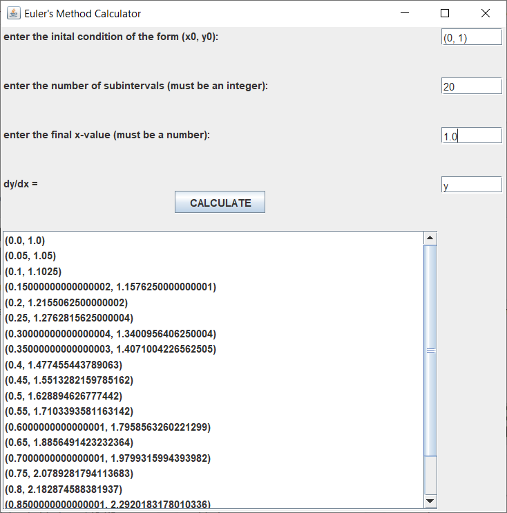

# Euler's method

This program was a personal passion project written during my junior year of high school, in 2016, a month or two before the [Integrator](https://github.com/rossgk2/Integrator) project. I was really excited about writing this program because it allowed me to approximate Euler's number, e. Euler's number is special in mathematics for many reasons. In my opinion, the most important reason is that f(x) = e^x is the unique function (up to a constant) that is its own derivative. Happily enough, this fact is highly relevant to this program!

## What is Euler's method?

[Euler's method](https://en.wikipedia.org/wiki/Euler_method) can be read about elsewhere, but I will briefly describe it here. Suppose we are trying to determine the function y that satifies a differential equation of the form dy/dx = g(x, y), where g is some other function, and where we also know that y(x0) = y0, for some particular x0 and y0. For example, we might have dy/dx = x * y(x) and y(0) = 1.

The idea of Euler's method is to use the derivative of y and the initial condition y(x0) = y0 (we know both of these things by assumption) to guess at what the value of y is for an arbitrary input, say x. For the sake of simplicity, assume that x > x0; assume x is "to the right of x0". One "starts" the approximation at the input x0 (we start here because we are given the constraint f(x0) = y0). To estimate y(x), we choose a step size of Delta, and increment from the input point x0 to the input point x1 = x0 + Delta. We then estimate y(x1) as y(x1) ~= y1, where y1 = y(x0) + Delta * df/dx|\_{x = x0} = y0 + Delta * g(x0, y). What we have done here is estimate the value of y at x1 by using the known value of y(x) at x0, travel the short horizontal distance of Delta along the line tangent to y(x) at x0, and measure the height of this tangent line after that short horizontal distance has been traversed. We keep repeating this process (jump to the ith input point, xi, and approximate y(xi) as y(xi) ~= yi, where yi = y\_{i - 1} + (Delta x) * g(x\_{i - 1}, y) until we have reached xn. We can make sure that xn is x, the input point at which we want to approximate y, by construction.

## Implementation and example

In this program, the user specifies the "problem": they specify the g(x, y) for which dy/dx = g(x, y), the x0 and y0 for which y(x0) = y0. More interestingly, they also specify the answers they would like to recieve from the problem; that is, the user specifies the input value x at which we would like to approximate f(x), and the number of subintervals n that the interval [min(x0, x), max(x0, x)] should be divided into. (Note, specificying what both of these things are determines the step size Delta). 

As is seen in the example, the approximation gets better as the number of subintervals increases.
