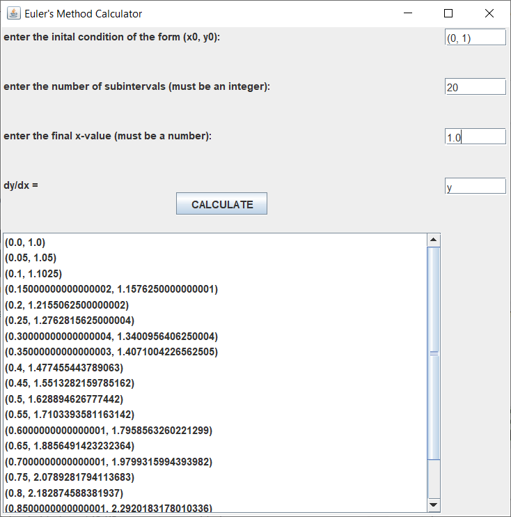

# Euler's method

This program was a personal passion project written during my junior year of high school, in 2016, a month or two before the [Integrator](https://github.com/rossgk2/Integrator) project. I was really excited about writing this program because it allowed me to approximate Euler's number, $e$. Euler's number is special in mathematics because, while exponential functions are proportional to their own derivatives, $e$ is the base of the exponential function for which the proportionality constant is $1$. In other words, $e$ is the base of the exponential function that *is* its own derivative, $\frac{d}{dx} e^x = e^x$. Happily enough, this fact is highly relevant to this program!

## What is Euler's method?

[Euler's method](https://en.wikipedia.org/wiki/Euler_method) can be read about elsewhere, but I will briefly describe it here. Suppose we are trying to determine the function $y$ that satisfies a differential equation of the form

$$
\frac{dy(x)}{dx} = g(x, y(x)),
$$

where $g$ is some other function, and where we also know that $y(x\_0) = y\_0$, for some particular $x\_0$ and $y\_0$. For example, we might have $\frac{dy(x)}{dx} = xy(x)$ and $y(0) = 1$.

The idea of Euler's method is to use the derivative of $y$ and the initial condition $y(x\_0) = y\_0$ (we know both of these things by assumption) to guess at what the value of $y$ is for an arbitrary input, say $x$. For the sake of simplicity, assume that $x > x\_0$; assume $x$ is "to the right of $x\_0$". One "starts" the approximation at the input $x\_0$ (we start here because we are given the constraint $f(x\_0) = y\_0$). To estimate $y(x)$, we choose a step size of $\Delta x$, and increment from the input point $x\_0$ to the input point $x\_1 = x\_0 + \Delta x$. We then estimate $y(x\_1)$ as $y(x\_1) \approx y\_1$, where

$$
y\_1 = y(x\_0) + \Delta x \frac{df}{dx}\Big|\_{x = x\_0} = y\_0 + \Delta x g(x\_0, y(x\_0))
$$

What we have done here is estimate the value of $y$ at $x\_1$ by using the known value of $y(x)$ at $x\_0$, travel the short horizontal distance of $\Delta x$ along the line tangent to $y$ at $x\_0$, and measure the height of this tangent line after that short horizontal distance has been traversed. We keep repeating this process (jump to the $`i`$th input point, $x\_i$, and approximate $y(x\_i)$ as $y(x\_i) \approx y\_i$, where $y\_i = y\_{i - 1} + \Delta x g(x\_{i - 1}, y)$ until we have reached $x\_n$. We can make sure that $x\_n$ is $x$, the input point at which we want to approximate $y$, by construction.

## Implementation and example

In this program, the user specifies the "problem": they specify the $g(x, y)$ for which $\frac{dy}{dx} = g(x, y)$, the $x\_0$ and $y\_0$ for which $y(x\_0) = y\_0$. More interestingly, they also specify the answers they would like to recieve from the problem; that is, the user specifies the input value $x$ at which we would like to approximate $f(x)$, and the number of subintervals $n$ that the interval $[\min(x\_0, x), \max(x\_0, x)]$ should be divided into. (Note, specificying what both of these things are determines the step size $\Delta x$). 

**Most interestingly**, since $\frac{d}{dx} e^x = e^x$, we can approximate $e = e^1$ by using $g(x, y) = y$ and $y(0) = 1$. (We know $y(0) = 1$ because $y(0) = e^0 = 1$). The approximate value for $e$ will be the second coordinate of the entry of the table whose first coordinate is 1.0.

We see that the approximate value for $e$ is getting close to the true value (up to 8 decimal places) of 2.71828183. We also see that the approximation gets better as the number of subintervals increases.
